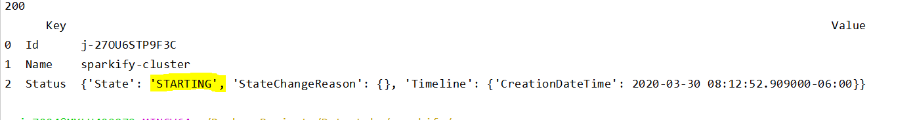
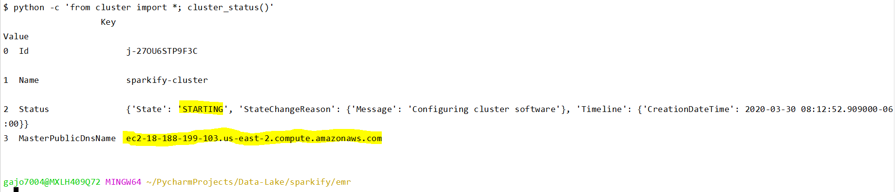
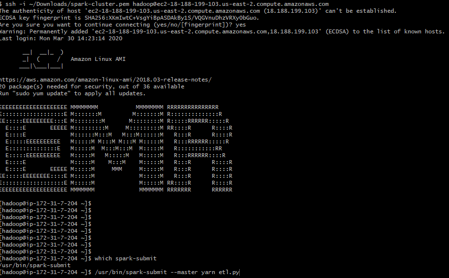

# Sparkify -  Data model

This is a pipeline whose main purpose is to get insights about Sparkify application usage. 
Next, the 3 questions/queries that this project answers: 
    
    - Give me the artist, song title and song's length in the music app history that was heard during sessionId = 338, and itemInSession = 4
    - Give me only the following: name of artist, song (sorted by itemInSession) and user (first and last name) for userid = 10, sessionid = 182
    - Give me every user name (first and last) in my music app history who listened to the song 'All Hands Against His Own'
    
All tables were designed based on the needs of analytics team. 

## Getting Started

### Prerequisites

    - An Amazon Web Services account. Key and Secret key are requiered to set up the a Elastic Map Reduce (EMR) cluster.
    - Python 3
    
    Next, the recommended EMR configurations
        - 4 nodes
            - Core nodes - m5.xlarge 4 vCore, 16 GiB memory, EBS only storage, EBS Storage:64 GiB
            - Master node - m5.xlarge 4 vCore, 16 GiB memory, EBS only storage, EBS Storage:64 GiB    
        - On demand     
        - Software required 
            - Hadoop 2.8.5
            - Spark 2.4.4
            
### Running 

For creating a EMR cluster, follow the next steps:

1. Set in ./emr/cfg file the following attributes

    - KEY *
    - SECRET *
    
    The other configuration values are optional, you can keep the original values
    
    * Get this credentials from your AWS account. Don't share and keep them save.

2. In a terminal go to emr folder and execute:
    `python -c 'from cluster import *; create_cluster()'`  
    
    This command will create a AWS cluster with the settings of emr/dwh.cfg file
    
    

3. Execute:
    `python -c 'from cluster import *; cluster_status()'`
    
    The current cluster status will appear in the console. 
    
    
    
    Note MasterPublicDnsName property, this will be the address to connect via ssh to the master node
    
4. When the cluster status is WAITING, the cluster is ready to be used. Now you can upload the etl folder
    of this project and execute spark submit to start the ETL process.
    
    Reference commands:
    
        `scp -i ~/spark-cluster.pem [PROJECT_DIR]/etl/etl.py hadoop@[MASTER_PUBLIC_DNS]:/home/hadoop/etl.py`
        `scp -i ~/spark-cluster.pem [PROJECT_DIR]/etl/dl.cfg hadoop@[MASTER_PUBLIC_DNS]:/home/hadoop/etl.py`
        `ssh -i ~/spark-cluster.pem hadoop@[MASTER_PUBLIC_DNS]`
   
     * Replace ~ with the path where file spark-cluster.pem was saved. 
     * spark-cluster.pem file is obtained from AWS Admin console. 
   
    Once logged in the master node, execute the following command to submit the job
        
    `/usr/bin/spark-submit --master yarn etl.py`
   
    

5. In order to delete the cluster and avoid unexpected charges, execute
 
    `python -c 'from cluster import *; delete_cluster()'`
            
    
    
    You can see the instruction status with the following command
    
    `python -c 'from cluster import *; cluster_status()'`

    
           
## ##########################################

    
## Dimension model design    
 
**song_plays**: It is used as a fact table. It is partitioned by **year** and **month**

**users**: Table dimension for user's info.

**songs**: Dimension table for song's data. It is partitioned by **year** and **artist_id**   

**artists**: Dimension table which contains artist information. 

**time**: Dimension table for time purposes. Partitioned by **year** and **month**

## Files description

**emr/cluster.py**: Script to create a EMR cluster

**cluster/dwh.cfg**: It contains properties needed to create a cluster

**etl/etl.py**: It contains the ETL process. It has a main method who invokes different function to get the job done.

**etl/dl.cfg**: Config file 

**resources/*.png**: Images used in documentation 

